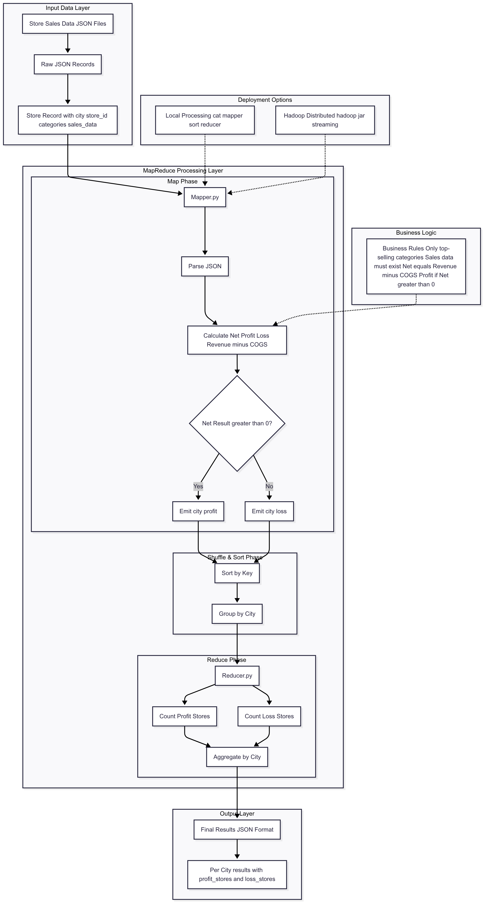

# Store Profit and Loss Analysis

A MapReduce solution for analyzing retail chain store profitability across multiple cities in India.

This project processes sales data from a retail chain that operates stores across multiple cities in India. Each store specializes in different product categories based on local consumer demand. The system calculates profit/loss for each store and aggregates the results by city.

---

## Architecture Diagram



---

## Problem Statement

Given sales data from retail stores, determine:
- Number of profitable stores per city
- Number of stores operating at a loss per city

### Key Business Rules

1. Each store has top-selling categories that determine profitability
2. Only categories with recorded sales data (revenue and COGS) are considered
3. A store's net result is calculated only if at least one top-selling category has sales data
4. Net Result = Revenue - COGS (Cost of Goods and Services)
5. If Net Result > 0: Profitable store, otherwise: Loss-making store

## Input Format

JSON objects with the following structure:

```json
{
  "city": "Bangalore",
  "store_id": "ST01293",
  "categories": ["Electronics", "Groceries"],
  "sales_data": {
    "Electronics": {
      "revenue": 600000,
      "cogs": 500000
    },
    "Groceries": {
      "revenue": 250000,
      "cogs": 270000
    }
  }
}
```

## Output Format

JSON objects aggregated by city:

```json
{"city": "Bangalore", "profit_stores": 2, "loss_stores": 0}
{"city": "Chennai", "profit_stores": 1, "loss_stores": 1}
{"city": "Mumbai", "profit_stores": 2, "loss_stores": 0}
```

## Files Structure

```
├── mapper.py          # MapReduce mapper implementation
├── reducer.py         # MapReduce reducer implementation
├── small_data.json    # Sample test dataset
├── large_data.json    # Large test dataset
├── expected_output_small_data.txt    # Expected output for small dataset
├── expected_output_large_data.txt    # Expected output for large dataset
└── README.md          # This file
```

## Implementation Details

### Mapper (mapper.py)
- Reads JSON input line by line
- Calculates net profit/loss for each store based on top-selling categories
- Outputs intermediate key-value pairs: `(city, profit_status)`

### Reducer (reducer.py)
- Aggregates mapper output by city
- Counts profitable and loss-making stores per city
- Outputs final JSON results

### Constraints
- Only `json` and `sys` packages allowed
- Must handle large datasets efficiently without loading entire dataset into memory
- Follows standard MapReduce patterns for scalability

## Testing

### Local Testing

Test with sample dataset:
```bash
cat small_data.json | python3 mapper.py | sort -k 1,1 | python3 reducer.py
```

Test with large dataset:
```bash
cat large_data.json | python3 mapper.py | sort -k 1,1 | python3 reducer.py
```

### Hadoop Testing

Run on Hadoop cluster:
```bash
hadoop jar $HADOOP_HOME/share/hadoop/tools/lib/hadoop-streaming-<hadoop_version>.jar \
-mapper "$PWD/mapper.py" \
-reducer "$PWD/reducer.py" \
-input <path_to_input_in_hdfs> \
-output <path_to_output_folder_in_hdfs>
```

### Making Scripts Executable

Before running, make sure the scripts are executable:
```bash
chmod +x mapper.py reducer.py
```

## Expected Results

### Sample Dataset Results
```
{"city": "Ahmedabad", "profit_stores": 3, "loss_stores": 5}
{"city": "Bangalore", "profit_stores": 5, "loss_stores": 3}
{"city": "Chennai", "profit_stores": 3, "loss_stores": 5}
{"city": "Delhi", "profit_stores": 3, "loss_stores": 4}
{"city": "Hyderabad", "profit_stores": 3, "loss_stores": 5}
{"city": "Jaipur", "profit_stores": 3, "loss_stores": 5}
{"city": "Kanpur", "profit_stores": 0, "loss_stores": 8}
{"city": "Kolkata", "profit_stores": 8, "loss_stores": 1}
{"city": "Lucknow", "profit_stores": 8, "loss_stores": 0}
{"city": "Mumbai", "profit_stores": 4, "loss_stores": 4}
{"city": "Pune", "profit_stores": 2, "loss_stores": 5}
{"city": "Surat", "profit_stores": 3, "loss_stores": 5}
```

## Technical Requirements

- **Python 3.x**
- **Hadoop** (for distributed processing)
- **Unix/Linux environment** (for shell commands)

## Data Processing Logic

1. **Mapper Phase:**
   - Parse each JSON record
   - For each store, calculate total profit/loss from all top-selling categories with sales data
   - Emit `(city, "profit")` or `(city, "loss")` based on net result

2. **Reducer Phase:**
   - Group by city
   - Count occurrences of "profit" and "loss" for each city
   - Output aggregated results in JSON format

## Performance Considerations

- Streaming processing to handle large datasets
- Memory-efficient line-by-line processing
- Scalable MapReduce architecture
- Proper error handling for malformed data

## Error Handling

- Graceful handling of missing sales data
- Validation of JSON format
- Proper handling of edge cases (stores with no profitable categories)
